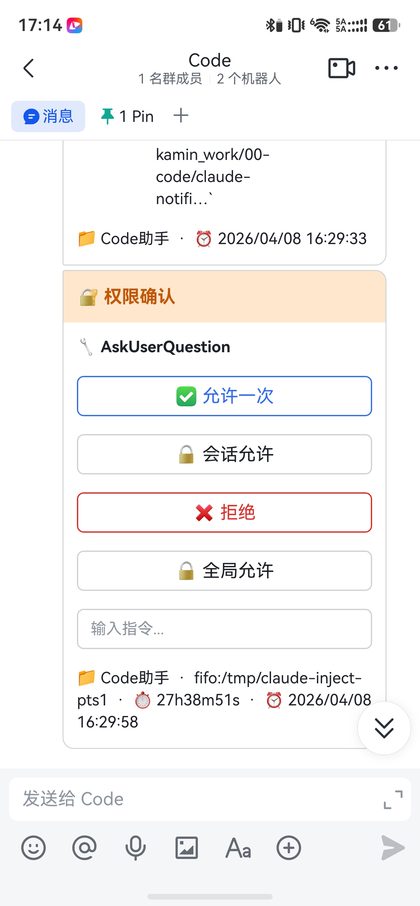
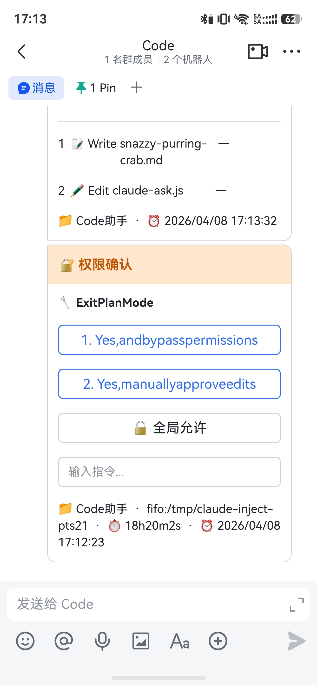
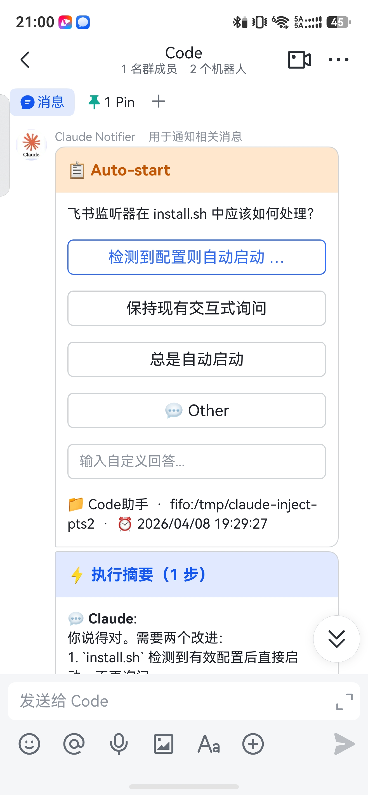
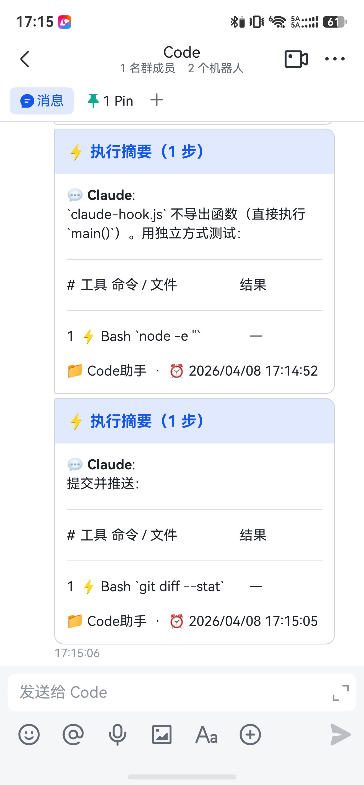
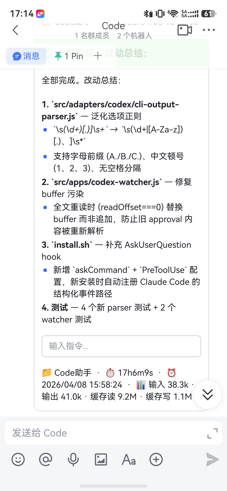
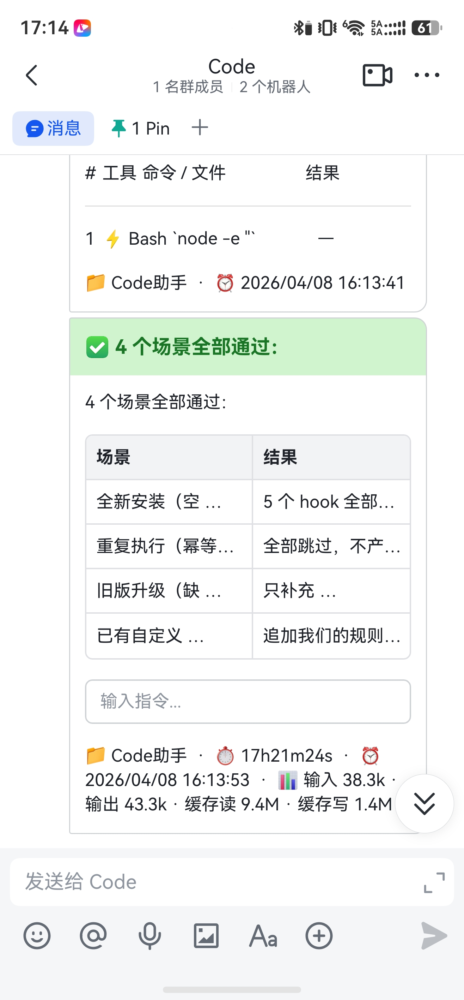

[English](./README.md) | [中文](./README.zh-CN.md)

# Agent Notifier — Feishu (Lark) Notifications for Claude / Codex CLI

> Route all AI coding assistant interactions to Feishu. Approve, pick options, and send commands from your phone — multi-device, no terminal babysitting required.

## Why This Approach

| Pain Point | How Agent Notifier Solves It |
|------------|------------------------------|
| Claude / Codex needs confirmations, permissions — you're chained to the terminal | Feishu interactive cards push in real time; tap once from phone, desktop, or tablet |
| You want mobile access but there's no official app | Feishu **is** your multi-platform app — iOS / Android / Mac / Windows / Web |
| Self-hosted push needs a server, domain, and DNS setup? | Feishu's long-polling mode connects directly — no public IP or domain required |
| Enterprise approval workflows are painful? | Feishu enterprise custom apps get approved in minutes; works for individuals too, completely free |
| Running tasks across multiple terminals — notifications are a mess? | Multi-terminal parallel routing keeps each terminal's interactions isolated and independent |

---

## Preview

<table>
<tr>
<td align="center" width="33%">
<br/>
<b>Permission Confirmation</b><br/>
<sub>Allow / Deny / Allow for Session / Allow Globally + text input<br/>Footer: project name · terminal ID (fifo) · session duration</sub>
</td>
<td align="center" width="33%">
<br/>
<b>Permission Options</b><br/>
<sub>Tool option buttons like ExitPlanMode + text input<br/>Footer: project name · terminal ID (fifo) · session duration</sub>
</td>
<td align="center" width="33%">
<br/>
<b>Choice Selection</b><br/>
<sub>AskUserQuestion dynamic options + Other + free-text input<br/>Footer: project name · terminal ID (fifo) · timestamp</sub>
</td>
</tr>
<tr>
<td align="center" width="33%">
<br/>
<b>Live Execution Summary</b><br/>
<sub>Tool call table · patches in place for the same task<br/>Footer: project name · timestamp</sub>
</td>
<td align="center" width="33%">
<br/>
<b>Task Complete</b><br/>
<sub>Change summary + text input for follow-up<br/>Footer: project name · session duration · token usage stats</sub>
</td>
<td align="center" width="33%">
<br/>
<b>Completion Notification (with Stats)</b><br/>
<sub>Test results table + text input for follow-up<br/>Footer: project name · session duration · token usage stats</sub>
</td>
</tr>
</table>

---

## Card Types

| Scenario | Card Color | Description |
|----------|------------|-------------|
| Permission confirmation | 🟠 Orange | Allow / Allow for session / Deny + text input |
| AskUserQuestion single-select | 🟠 Orange | Dynamic option buttons + Other + text input |
| AskUserQuestion multi-part | 🟠 Orange | Q1 → Q2 → Q3 sent one card at a time |
| Task complete | 🟢 Green | Summary, duration, tokens + text input |
| Abnormal exit | 🔴 Red | Error details + text input |
| Live execution summary | 🔵 Blue | Patches the same card in place for the current task |

---

## Feature Overview

**Notifications** — Feishu interactive cards / task completion & failure alerts / live execution summaries / session duration & token stats / local audio alerts

**Interactions** — Button clicks flow back to the terminal / text input flows back to the terminal / multi-terminal parallel routing / shared entry point for both Claude and Codex

---

## Quick Start

### 1. Clone the Repository

```bash
git clone <repo-url>
cd agent_notifier
```

### 2. Configure the Feishu App

Edit `.env` (automatically created from `.env.example` on first install):

```bash
FEISHU_APP_ID=your_app_id_here
FEISHU_APP_SECRET=your_app_secret_here
FEISHU_CHAT_ID=your_chat_id_here
```

> For step-by-step instructions on creating and approving a Feishu custom app, see [Feishu Setup Guide](#feishu-setup-guide) below.

### 3. Install

```bash
bash install.sh
```

The install script handles everything automatically:
- Checks dependencies (Node.js, npm, python3)
- **Cleans up previous configuration** (runs `uninstall.sh` internally)
- Installs Node.js dependencies
- Creates `.env` from `.env.example` (if it doesn't exist)
- Writes Claude Code hooks to `~/.claude/settings.json`
- Injects `claude` / `codex` shell wrapper functions
- **Starts the Feishu listener and registers it for auto-start on boot**

> Running `install.sh` multiple times is safe — it cleans up before reinstalling each time.

### 4. Reload Your Shell

```bash
source ~/.zshrc
# or source ~/.bashrc
```

### 5. Start Using It

```bash
claude
# or
codex
```

---

## Uninstall

To temporarily stop the Feishu listener and Codex watcher started by `install.sh`, while keeping hooks, shell functions, `.env`, and auto-start configuration:

```bash
bash stop-services.sh
# or
npm run services:stop
```

To fully uninstall and remove configuration:

```bash
bash uninstall.sh
```

The uninstall script cleans up:
- Stops and removes the Feishu listener service (launchd / systemd / crontab)
- Terminates background processes (feishu-listener, codex-watcher, codex-session-watcher, pty-relay)
- Removes hooks from `~/.claude/settings.json`
- Removes shell function injections from `~/.zshrc` / `~/.bashrc`
- Cleans up runtime files (session-state, pid, log, /tmp buffer files)

> `.env` and `node_modules/` are preserved. Delete them manually if you want a full cleanup.

---

## Cross-Platform Support

| Platform | Service Management | Auto-Start on Boot |
|----------|-------------------|--------------------|
| macOS | launchd (`~/Library/LaunchAgents/`) | `RunAtLoad` + `KeepAlive` |
| Linux (with systemd user session) | systemd user service | `systemctl --user enable` |
| Linux (no systemd, e.g. pure SSH) | nohup + crontab `@reboot` | crontab fallback |

### Service Management Commands

**macOS:**
```bash
# Check status
launchctl print gui/$(id -u)/com.agent-notifier.feishu-listener
# Stop
launchctl bootout gui/$(id -u) ~/Library/LaunchAgents/com.agent-notifier.feishu-listener.plist
# Start
launchctl bootstrap gui/$(id -u) ~/Library/LaunchAgents/com.agent-notifier.feishu-listener.plist
```

**Linux (systemd):**
```bash
systemctl --user status agent-notifier-feishu
systemctl --user restart agent-notifier-feishu
journalctl --user -u agent-notifier-feishu -f
```

---

## Configuration

### `.env` Example

```bash
# Feishu custom app
FEISHU_APP_ID=your_app_id_here
FEISHU_APP_SECRET=your_app_secret_here
FEISHU_CHAT_ID=your_chat_id_here

# Default host (optional)
# DEFAULT_AGENT_HOST=claude
# CODEX_BIN=codex

# Explicitly specify tmux pane (optional)
# CLAUDE_TMUX_TARGET=claude:0.0

# Live summary (optional)
# FEISHU_LIVE_CAPTURE=1
# FEISHU_LIVE_DEBOUNCE_MS=3000

NOTIFICATION_ENABLED=true
# NOTIFICATION_EXPIRE_HOURS=12
# ENABLE_ESC_BUTTON=true
SOUND_ENABLED=true
```

### `FEISHU_LIVE_CAPTURE` Options

Accepted values:
- `1` / `true`: Enable all capture modes
- `tools`: Tool / command summaries
- `output`: Assistant output content
- `results`: Tool execution result summaries
- Combine as needed: `tools,output,results`

Codex output is sourced from `~/.codex/sessions/*.jsonl`, not inferred from terminal text.

---

## Feishu Setup Guide

### 1. Create a Custom App
Log in to the [Feishu Open Platform](https://open.feishu.cn) and create an enterprise custom app.

### 2. Get App ID / App Secret
Copy the credentials from the app dashboard and add them to `.env`.

### 3. Enable Bot Capability
Turn on the Bot feature under App Capabilities.

### 4. Set Event Subscription to Long Polling
No public IP or domain needed.

### 5. Add Events
- `card.action.trigger`

### 6. Request Permissions
- `im:message`
- `im:message:send_as_bot`
- `im:chat:readonly`

### 7. Publish the App
After publishing, add the bot to your target group chat.

---

## Common Commands

### Install / Uninstall

`install.sh` starts both the Feishu callback listener and the Codex interactive-card watcher:
- Linux systemd user: `agent-notifier-feishu.service`, `agent-notifier-codex-watcher.service`
- macOS launchd: `com.agent-notifier.feishu-listener`, `com.agent-notifier.codex-watcher`
- Linux without systemd: nohup processes plus crontab `@reboot` entries

`stop-services.sh` / `npm run services:stop` only stops these persistent services. It does not remove hooks, shell functions, `.env`, `node_modules`, or auto-start configuration.

```bash
bash install.sh          # Install (auto-cleans old config → reinstalls and starts services)
bash stop-services.sh    # Stop persistent services while keeping installation config
bash uninstall.sh        # Uninstall (stops services → cleans up config)
npm run services:stop    # Same as bash stop-services.sh
```

### Feishu Listener (Manual)

```bash
npm run feishu-listener         # Run in foreground
npm run feishu-listener:start   # Start in background with nohup
npm run feishu-listener:stop    # Stop background process
```

### Codex Commands

```bash
npm run codex-watcher
npm run codex-watcher:start
npm run codex-watcher:stop
```

---

## Architecture Overview

### Claude Pipeline
- Claude Hooks fire events → `src/apps/claude-hook.js` builds cards → Feishu listener receives callbacks → input injected back into the local terminal

### Codex Pipeline
- `pty-relay.py` establishes a terminal bridge → `src/apps/codex-watcher.js` handles interactive cards → `src/apps/codex-session-watcher.js` reads session files → `src/apps/codex-live.js` handles live summary cards

### Terminal Injection Methods

To route Feishu input back to Claude / Codex, the project supports several injection methods:

| Method | Use Case |
|--------|----------|
| tmux | Recommended — run `claude` / `codex` inside a tmux session |
| PTY relay | Non-tmux environments; `pty-relay.py` sets up a FIFO injection channel automatically |
| Explicit tmux pane | `CLAUDE_TMUX_TARGET=claude:0.0` |

Injection priority: `CLAUDE_TMUX_TARGET` > auto-detected tmux pane > FIFO relay > pty master direct write > TIOCSTI fallback

### Hook Configuration

Handled automatically by `install.sh`. For manual setup, add to `~/.claude/settings.json`:

```json
{
  "hooks": {
    "Stop": [{ "hooks": [{ "type": "command", "command": "node /path/to/hook-handler.js" }] }],
    "Notification": [{ "matcher": "permission_prompt|idle_prompt|elicitation_dialog", "hooks": [{ "type": "command", "command": "node /path/to/hook-handler.js" }] }],
    "StopFailure": [{ "hooks": [{ "type": "command", "command": "node /path/to/hook-handler.js" }] }],
    "PostToolUse": [{ "matcher": "Bash|Write|Edit|NotebookEdit", "hooks": [{ "type": "command", "command": "node /path/to/live-handler.js" }] }]
  }
}
```

---

## Testing & Debugging

```bash
# Run tests
bun test tests/
python3 -m py_compile pty-relay.py

# Send test cards
node scripts/send-codex-feishu-test-cards.js --pts /dev/pts/<N>
npm run ask:e2e:card
```

Recommended manual checks:
- Claude completion card sends correctly
- Codex text input / approval / single-select / multi-select all flow back to the terminal
- Codex live cards patch in place for the same task and create new cards for new tasks
- Long text is properly chunked

---

## Notes

- In PTY raw mode, Enter sends `\r` (CR), not `\n` (LF)
- Completion cards include a text input field for easy follow-up conversation
- `im.message.patch` strips input fields, so completion cards are always sent as new messages while in-progress cards use patch
- Keep sensitive config in `.env` — do not commit it

---

## Contributing

If you're looking to contribute or extend the project, start with:
- `docs/ai_rules.md`
- `docs/ai_docs/README.md`
- `src/apps/claude-hook.js`
- `src/apps/codex-live.js`
- `src/apps/codex-watcher.js`
- `src/channels/feishu/feishu-interaction-handler.js`

---

## License

[MIT](./LICENSE)
